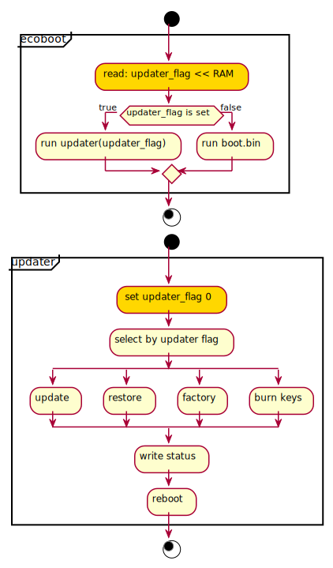
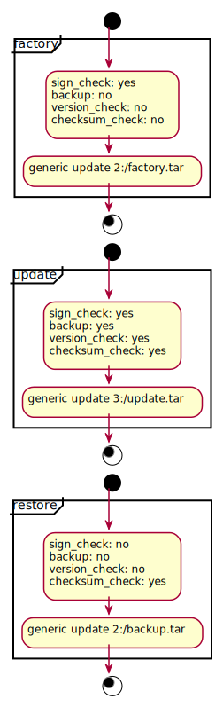
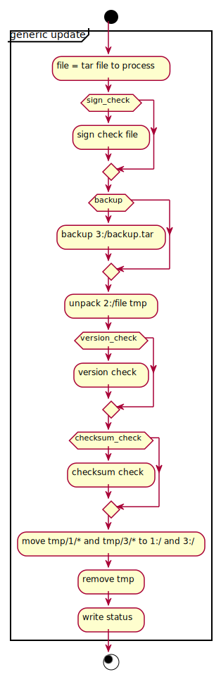

# How to boot Mudita Pure and create a storage partition

## Booting Mudita Pure

PureOS has three elements involved in boot and update. Each with its distinctive role:
- *ecoboot.bin* - called later *bootloader*, initializes basic hardware, selects what application should be used next and calls it
- *updater.bin* - called later *updater*, performs all update required actions such as package verification and unpack
- *boot.bin* - called later *MuditaOS*, binary with all phone functionality

All binaries are released on their respective source pages:
- [ecoboot/releases](https://github.com/mudita/ecoboot/releases/).
- [updater/releases](https://github.com/mudita/PureUpdater/releases/).
- [MuditaOS/releases](https://github.com/mudita/MuditaOS/releases/).

All binaries are updated with UpdatePackage loaded on phone upon update trigger.

### Boot and update process

To either perform normal boot or phone update bootloader reads requested functionality passed on ram and executes updater with it as parameter.  

Update action trigger can be done two way. Normal flow is via API, where phone is instructed to perform any of updater actions, or it can be selected manually in bootloader menu.  
To perform update it's required that update package generated with Pure-UpdatePackage is loaded on user partition either by: 1. MuditaOS 2. Python API 3. manually after mount with fuse.



With action selected, bootloader can perform any of update actions, plus is able to burn signature for production.
Update related actions are named self explanatory and are:
- update
- restore
- factory reset

As update actions uses the same code with different options functionalities selected.



With action selected, options are set and generic update flow is being executed.



When action is processed by updater it reboots phone to bootloader - then bootloader boots the current OS.
Update result is shown on screen as a status as well as is saved in updater log file called updater.log on user partition

## Creating a storage partition
 
1. Switch the phone to MSC mode (bootloader option 4)

2. Unmount disk from the OS so that it's not used

3. Find the disk name that is assigned to the phone (sda, sdb etc.)

4. Find out if the disk is mounted (assuming /dev/sda)

```bash
[atom@nucleus:~/devel/PurePhone_14/doc]$ cat /etc/mtab | grep /dev/sda | awk '{print $2}'
/mnt
```

5. Unmount `/dev/sda` from `/mnt` before you do anything else

```bash
# sudo umount /mnt 
```

6. Move into the project root directory and run the image generation script

```bash
    ./generate_image.sh pure.img build-rt1051-Debug
```
   
   Example output:
```
Checking that no-one is using this disk right now ... OK

Disk /home/lucck/worksrc/MuditaOS/pure.img: 14,62 GiB, 15678308352 bytes, 30621696 sectors
Units: sectors of 1 * 512 = 512 bytes
Sector size (logical/physical): 512 bytes / 512 bytes
I/O size (minimum/optimal): 512 bytes / 512 bytes

>>> Script header accepted.
>>> Script header accepted.
>>> Script header accepted.
>>> Created a new DOS disklabel with disk identifier 0x09650eb4.
/home/lucck/worksrc/MuditaOS/pure.img1: Created a new partition 1 of type 'W95 FAT32' and of size 1 GiB.
/home/lucck/worksrc/MuditaOS/pure.img2: Created a new partition 2 of type 'Unknown' and of size 1 GiB.
/home/lucck/worksrc/MuditaOS/pure.img3: Created a new partition 3 of type 'Unknown' and of size 12,6 GiB.
/home/lucck/worksrc/MuditaOS/pure.img4: Done.

New situation:
Disklabel type: dos
Disk identifier: 0x09650eb4

Device                                 Boot   Start      End  Sectors  Size Id Type
/home/lucck/worksrc/MuditaOS/pure.img1 *       2048  2099199  2097152    1G  b W95 FAT32
/home/lucck/worksrc/MuditaOS/pure.img2      2099200  4196351  2097152    1G  b W95 FAT32
/home/lucck/worksrc/MuditaOS/pure.img3      4196352 30621695 26425344 12,6G 9e unknown

The partition table has been altered.
Syncing disks.
Littlefs summary:
     Directories created: 5, Files added: 24, Transferred 1198 kbytes.
          Littlefs block size: 32768 blocks: 57/412895.
          /home/lucck/worksrc/MuditaOS

```

7. Once completed, flash the phone with the latest MuditaOS build. To do that run the `pureflash` command 
on the image:

```bash
sudo pureflash pure.img /dev/sdX
```

**Note:** Replace `/dev/sdX` with the disk name you found for your phone after connecting it to your computer.

Example output:

```bash
➜  build-linux-Debug git:(EGD-6188_flashing_script) ✗ ./pureflash ~/worksrc/MuditaOS/build-rt1051-RelWithDebInfo/PurePhone.img /dev/sda 
File /home/lucck/worksrc/MuditaOS/build-rt1051-RelWithDebInfo/PurePhone.img copy 7 extents:
#       Offset          Length           Status
0:      0000000000000000 0000000000001000 OK
1:      0000000000100000 0000000000001000 OK
2:      0000000000104000 0000000000a2d000 OK
3:      0000000040100000 0000000000001000 OK
4:      0000000040104000 0000000000200000 OK
5:      0000000080100000 0000000000010000 OK
6:      0000000320e20000 00000000001c0000 OK
File /home/lucck/worksrc/MuditaOS/build-rt1051-RelWithDebInfo/PurePhone.img verify 7 extents:
#       Offset          Length           Verify
0:      0000000000000000 0000000000001000 OK
1:      0000000000100000 0000000000001000 OK
2:      0000000000104000 0000000000a2d000 OK
3:      0000000040100000 0000000000001000 OK
4:      0000000040104000 0000000000200000 OK
5:      0000000080100000 0000000000010000 OK
6:      0000000320e20000 00000000001c0000 OK
Write image /home/lucck/worksrc/MuditaOS/build-rt1051-RelWithDebInfo/PurePhone.img to /dev/sda SUCCESS
➜  build-linux-Debug git:(EGD-6188_flashing_script) ✗ 
```
